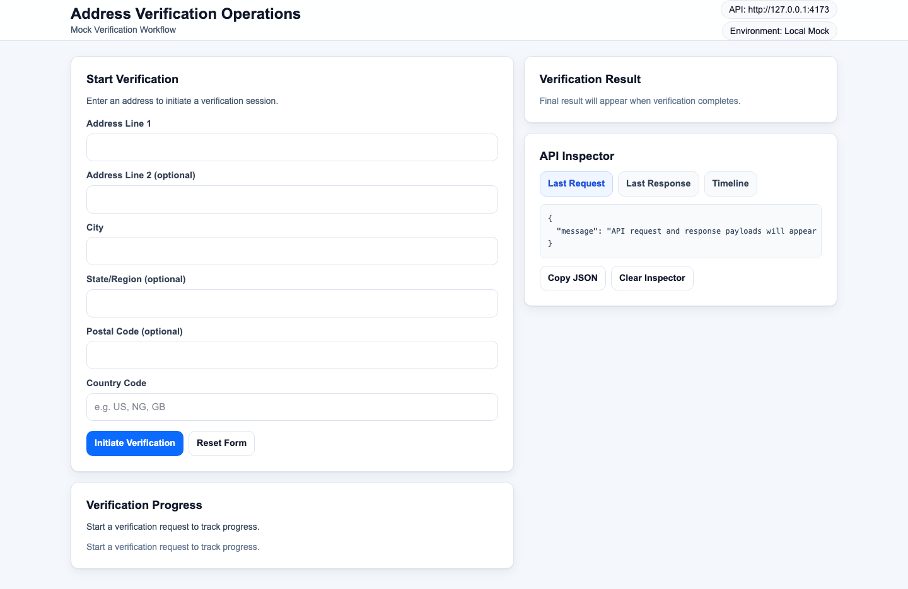
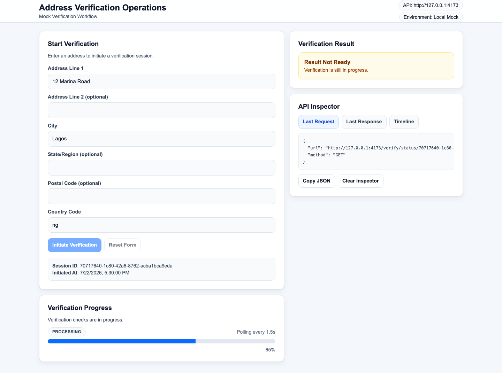
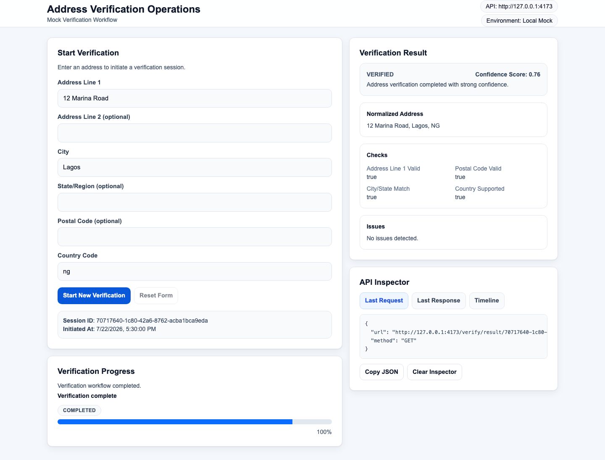
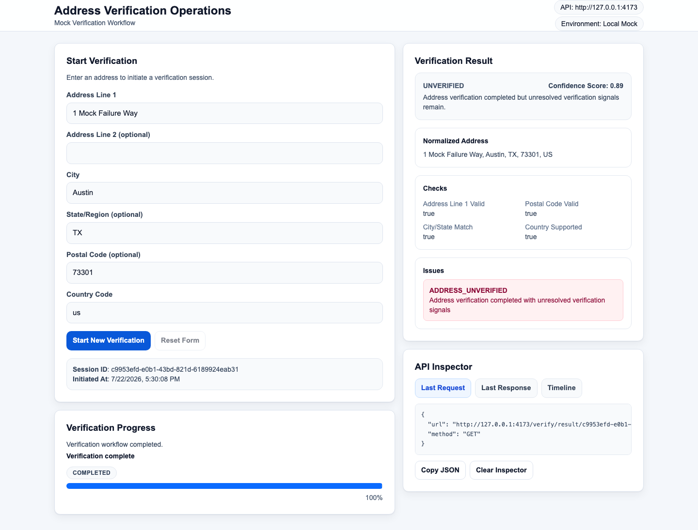
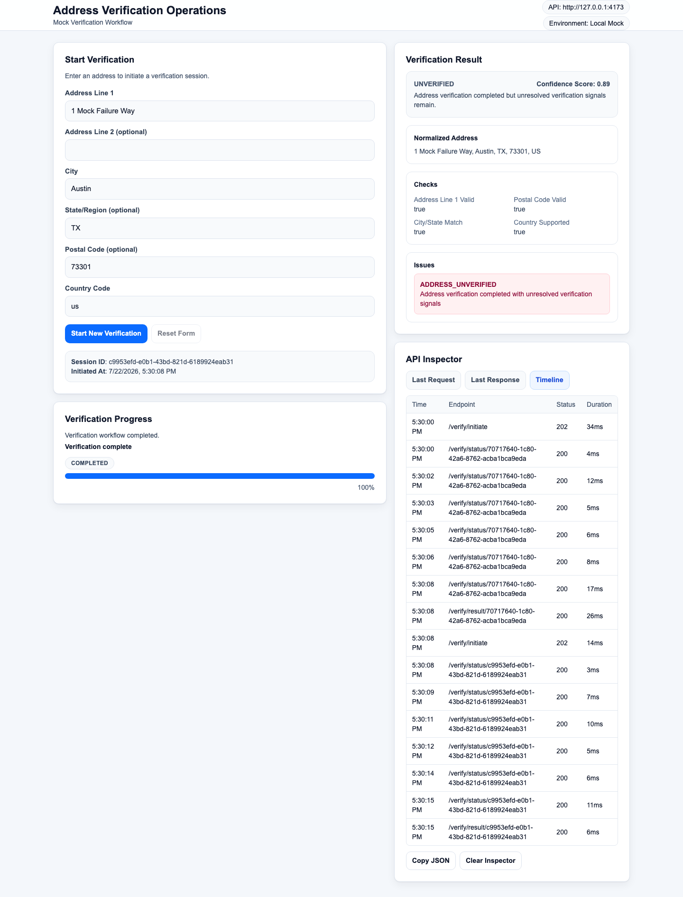
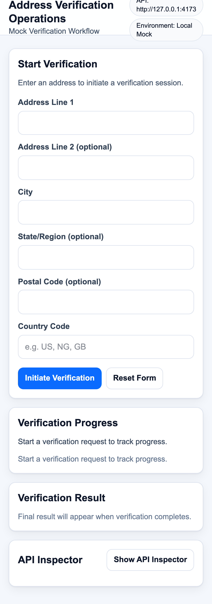
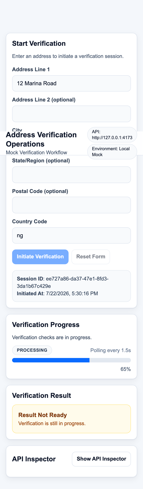
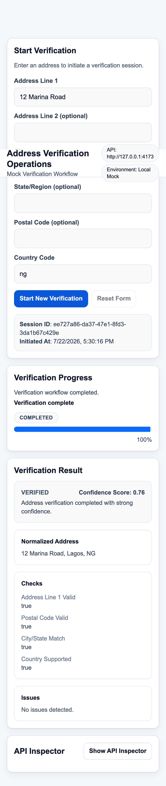
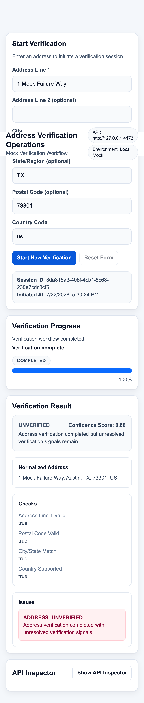
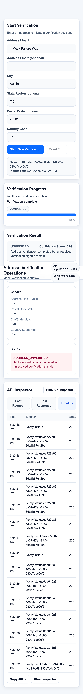

# OrgByte Address Verification Assessment

Assessment-ready monorepo implementing an API-first mock Address Verification workflow for OrgByte.

## Project Purpose

This repository demonstrates a production-style engineering approach within strict assessment scope:

- contract-first API design
- deterministic mock lifecycle simulation
- responsive, accessible operations dashboard
- automated quality gates and browser smoke coverage

The goal is reviewer clarity: clone, install, run, validate, and understand behavior without additional explanation.

## OrgByte Assessment Requirements Coverage

Implemented exactly as required:

- Exactly three endpoints:
  - `POST /verify/initiate`
  - `GET /verify/status/{sessionId}`
  - `GET /verify/result/{sessionId}`
- OpenAPI 3.1 contract in `docs/openapi.yaml`
- Mock asynchronous lifecycle:
  - `PENDING -> PROCESSING -> COMPLETED`
  - `PENDING -> PROCESSING -> FAILED`
- React + TypeScript dashboard:
  - address form
  - verification progress
  - result panel
  - API request/response inspector
- Automated checks:
  - lint, typecheck, tests, build, OpenAPI validation, browser smoke

Out-of-scope systems were intentionally not implemented:

- authentication/authorization
- database/persistent storage
- Docker/orchestration
- queues/event buses/WebSockets
- external verification providers
- deployment infrastructure

## Architecture

High-level flow:

1. User submits address via dashboard form.
2. Web app calls `POST /verify/initiate`.
3. API returns `202` with `sessionId` and `PENDING` state.
4. Web app polls `GET /verify/status/{sessionId}` every ~1.5s.
5. Terminal state reached:
   - `COMPLETED`: web app requests `GET /verify/result/{sessionId}`
   - `FAILED`: web app surfaces processing failure state
6. API inspector records every request/response pair and timeline row.

## Technology Choices

### Monorepo

- npm workspaces for multi-app coordination

### Frontend (`apps/web`)

- React 19 + TypeScript
- Vite 8
- Tailwind CSS 4
- TanStack Query (polling and request orchestration)
- React Hook Form + Zod (form validation/normalization)
- Vitest + React Testing Library
- Playwright (browser smoke)

### Mock API (`apps/mock-api`)

- Node.js + Express 5 + TypeScript
- Zod request validation and normalization
- UUID v4 session IDs
- Deterministic in-memory lifecycle simulation
- Vitest + Supertest

## Repository Structure

```text
.
├─ apps/
│  ├─ web/                  # React dashboard
│  └─ mock-api/             # Express mock verification API
├─ docs/
│  ├─ PRODUCT_ROADMAP.md
│  ├─ API_DESIGN.md
│  ├─ UI_DESIGN.md
│  ├─ openapi.yaml
│  └─ screenshots/          # Phase 8 submission screenshots
├─ scripts/
│  └─ validate-openapi.mjs
├─ package.json
└─ README.md
```

## Local Setup

Prerequisites:

- Node.js 22+
- npm 10+

Install dependencies:

```bash
npm install
```

Run apps in separate terminals:

```bash
npm run -w apps/mock-api dev
npm run -w apps/web dev -- --host 127.0.0.1 --port 4173
```

Open:

- Dashboard: `http://127.0.0.1:4173`
- Mock API: `http://127.0.0.1:4000`

## Environment Configuration

Frontend API base behavior:

- `VITE_API_BASE_URL` is used when provided.
- In development, when `VITE_API_BASE_URL` is not set, the frontend uses `window.location.origin` and Vite proxies `/verify` to `http://localhost:4000`.
- For non-development runtime (preview/production builds), `VITE_API_BASE_URL` must be set.

Examples:

```bash
# Optional in local dev
VITE_API_BASE_URL=http://127.0.0.1:4173

# Required for non-dev runtime
VITE_API_BASE_URL=https://your-api-host.example
```

## Available Scripts

Root scripts:

- `npm run lint` - lint all workspaces
- `npm run typecheck` - TypeScript checks across workspaces
- `npm run test` - run all tests
- `npm run build` - build all apps
- `npm run validate:openapi` - validate `docs/openapi.yaml`

Web app scripts:

- `npm run -w apps/web dev`
- `npm run -w apps/web build`
- `npm run -w apps/web test`
- `npm run -w apps/web smoke`

Mock API scripts:

- `npm run -w apps/mock-api dev`
- `npm run -w apps/mock-api build`
- `npm run -w apps/mock-api test`

## Verification Lifecycle

Session states:

- `PENDING`
- `PROCESSING`
- `COMPLETED`
- `FAILED`

Terminal states:

- `COMPLETED`
- `FAILED`

Deterministic elapsed-time transitions:

- Non-failure sessions:
  - `< 2000ms` -> `PENDING`
  - `2000ms .. <7000ms` -> `PROCESSING`
  - `>=7000ms` -> `COMPLETED`
- Processing-failure sessions:
  - `< 2000ms` -> `PENDING`
  - `2000ms .. <6000ms` -> `PROCESSING`
  - `>=6000ms` -> `FAILED`

Progress mapping:

- `PENDING` -> `25%`
- `PROCESSING` -> `65%`
- `COMPLETED` -> `100%`
- `FAILED` -> `100%`

## Deterministic Mock Verification Rules

At initiation, normalized input is transformed into a seed:

- `seed = addressLine1|addressLine2|city|state|postalCode|countryCode`
- `asciiSum = sum(charCode(seed))`

Outcome rules:

- `processingFailureKey = asciiSum % 10`
  - `0` or `1` -> session becomes `FAILED`
  - otherwise -> session can become `COMPLETED`
- `verdictKey = asciiSum % 3` (for `COMPLETED` sessions only)
  - `0` -> `VERIFIED`
  - `1` -> `PARTIALLY_VERIFIED`
  - `2` -> `UNVERIFIED`

Confidence score rule:

- `confidenceScore = min(0.99, 0.7 + ((asciiSum % 31) / 100))`
- rounded to 2 decimals

Issue generation:

- `COUNTRY_UNSUPPORTED` warning when country is outside `{US, CA, GB, AU, NG}`
- `PARTIAL_VERIFICATION` warning for `PARTIALLY_VERIFIED`
- `ADDRESS_UNVERIFIED` error for `UNVERIFIED`

## Testing Instructions

Run all required quality gates:

```bash
npm run lint
npm run typecheck
npm run test
npm run build
npm run validate:openapi
npm run -w apps/web smoke
```

Clean-install verification flow:

```bash
npm install
npm run lint
npm run typecheck
npm run test
npm run build
npm run validate:openapi
```

## OpenAPI Documentation

- Contract file: `docs/openapi.yaml`
- Supporting design references:
  - `docs/API_DESIGN.md`
  - `docs/UI_DESIGN.md`
  - `docs/PRODUCT_ROADMAP.md`

## Assumptions

- Single-tenant local mock environment is sufficient for assessment.
- In-memory sessions are acceptable and intentionally ephemeral.
- Deterministic rules are preferable to realism for test stability.

## Trade-offs

- Deterministic formulas improve repeatability but are less realistic than provider integrations.
- Polling is intentionally used over push channels to match scope.
- No persistence, auth, or distributed systems concerns are added to avoid overengineering.

## Future Production Improvements (Not Implemented)

- durable session persistence and idempotency keys
- authentication/authorization and tenancy controls
- rate limiting and abuse protection
- auditing, tracing, and observability stack
- external provider abstraction with fallback routing
- deployment automation and environment promotion

## Screenshots

Desktop:

- Initial screen  
  
- Active verification  
  
- Completed VERIFIED result  
  
- Completed UNVERIFIED result  
  
- Response inspector  
  

Mobile:

- Initial screen  
  
- Active verification  
  
- Completed VERIFIED result  
  
- Completed UNVERIFIED result  
  
- Response inspector  
  
