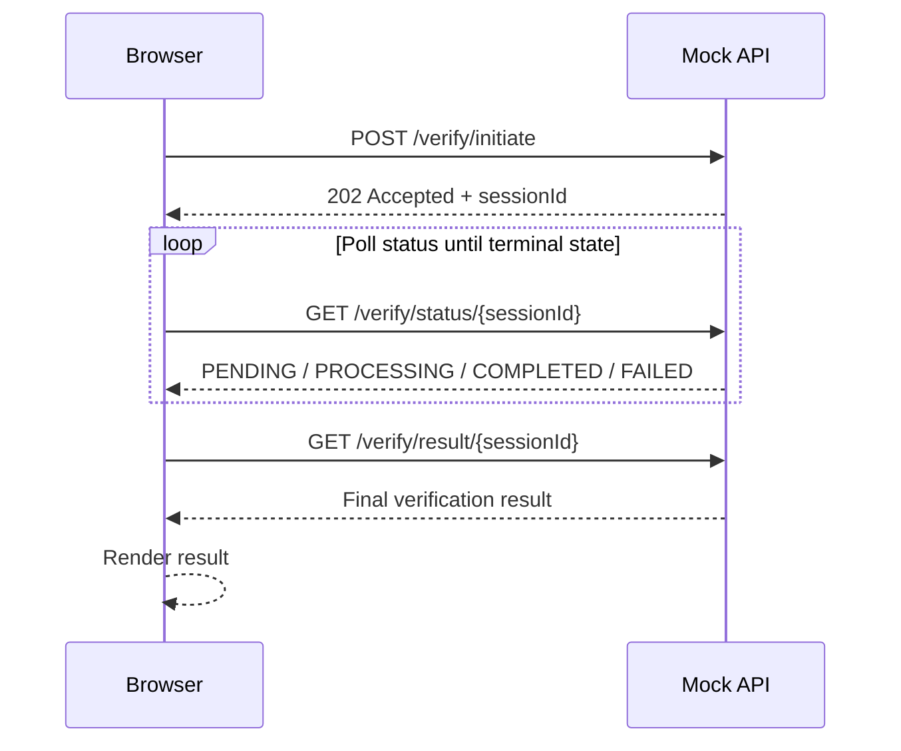

# PRODUCT_ROADMAP

## 1) Project Overview

### Objective

Deliver an assessment-ready monorepo for an Address Verification workflow that demonstrates API-first development and production-quality frontend/backend engineering practices, while strictly staying within OrgByte scope.

### Definition of Done

The project is complete only when all conditions below are true:

- OpenAPI 3.1 specification validates successfully.
- Frontend and mock API lint, typecheck, tests, and production builds pass.
- Browser smoke tests pass for the complete workflow and key error states.
- UI is responsive and keyboard accessible.
- No browser console errors occur during smoke-test scenarios.
- Documentation matches shipped implementation.
- Screenshots are included in the repository documentation.
- A clean-install dry run succeeds.
- `git status` is clean at submission time.
- No secrets, temporary files, irrelevant assets, `.DS_Store`, or `node_modules` are tracked.
- Repository is ready for an OrgByte reviewer to clone and run without clarification.

### In-Scope Outputs

- OpenAPI 3.1 YAML spec for exactly three endpoints:
  - `POST /verify/initiate`
  - `GET /verify/status/{sessionId}`
  - `GET /verify/result/{sessionId}`
- React dashboard consuming a mock API implementation of the same endpoints
- Mock asynchronous verification lifecycle using elapsed time (`PENDING -> PROCESSING -> COMPLETED` or `FAILED`)
- Documentation set in `docs/`
- Test coverage using Vitest + React Testing Library (frontend) and API tests appropriate for mock API behavior

### Explicit Out-of-Scope (Do Not Implement)

- Authentication/authorization
- Database/persistent storage
- Docker/container orchestration
- Microservices/queues/event buses
- WebSockets
- External verification provider integrations
- Cloud deployment pipelines

## 2) Requirements Analysis and Architecture Fit

### Requirement-to-Architecture Mapping

1. API-first requirement

- Fit: Approve API behavior/domain rules first, then formalize them in `docs/openapi.yaml` as the contract source.
- Outcome: Mock API and frontend both implement/consume this contract.

2. REST design with exact endpoint set

- Fit: Use Express routes matching exact paths and verbs.
- Outcome: No extra endpoints added.

3. Realistic async workflow

- Fit: In-memory session store + elapsed-time state transitions.
- Outcome: Polling in frontend via TanStack Query until terminal state.

4. Strong TypeScript and maintainability

- Fit: Shared domain types generated or mirrored from contract shape; strict TS configs.
- Outcome: Type-safe request/response handling and UI state modeling.

5. Responsive and accessible dashboard UX

- Fit: Tailwind layout system, semantic HTML, keyboard/focus states, status messaging.
- Outcome: Internal operations dashboard experience, not marketing landing page.

6. Testing expectations

- Fit: Vitest + RTL for UI workflow and component behavior; mock API route/state tests.
- Outcome: Confidence in async lifecycle, rendering, and error paths.

### Unnecessary Complexity to Avoid

- Adding any endpoint beyond the required three
- Building persistence layer or migration setup
- Implementing auth, rate limiting, tenancy, or RBAC
- Introducing websocket live updates (polling is required and sufficient)
- Over-abstracting with excessive layers or domain frameworks

### Missing Details to Define Early (Within Scope)

- Canonical response schemas for all endpoint outcomes (success + error)
- Terminal-state behavior for `/verify/result/{sessionId}` when status is not `COMPLETED`
- Polling interval, retry behavior, and timeout strategy in frontend
- Deterministic mock rules for confidence score/check outcomes to support stable testing
- Error model consistency (`400`, `404`, `409`/`422`, `500` if simulated)

### Recommended Improvements (Still In Scope)

- Add `docs/API_DESIGN.md` to document lifecycle semantics and state machine decisions
- Keep `docs/openapi.yaml` as single source of truth before route handlers/UI wiring
- Add lightweight schema validation with Zod at API boundaries
- Include developer response inspector panel in UI for contract transparency

## 3) Target Architecture

### Monorepo Structure

```text
apps/
  web/         # React + Vite + TypeScript + Tailwind + TanStack Query + RHF + Zod + Lucide
  mock-api/    # Express + TypeScript + Zod + UUID

docs/
  PRODUCT_ROADMAP.md
  API_DESIGN.md
  openapi.yaml

README.md
```

### Runtime Flow

1. User submits address in web app
2. Web app calls `POST /verify/initiate`
3. API returns `202 Accepted` with `sessionId` and initial status metadata
4. Web app polls `GET /verify/status/{sessionId}`
5. Status transitions over elapsed time to terminal state
6. On `COMPLETED`, web app fetches `GET /verify/result/{sessionId}` and renders full result
7. On `FAILED`, web app renders failure state and guidance

### Verification Sequence Diagram



### State Model

- `PENDING`
- `PROCESSING`
- `COMPLETED`
- `FAILED`

Terminal states: `COMPLETED`, `FAILED`

## 4) Engineering Principles

- Contract-first: OpenAPI is defined before implementation.
- Simplicity-first: meet assessment scope exactly; no speculative architecture.
- Type safety by default: strict TypeScript + schema validation.
- Predictable mocks: deterministic behavior where possible for test stability.
- Accessibility-first UI: semantic structure, keyboard support, clear status messaging.
- Observability for development: explicit error messages and response inspector panel.
- Documentation quality: decisions and tradeoffs are written, concise, and reviewable.

## 5) Phased Implementation Plan

## Phase 0: Scope Lock and Acceptance Baseline

### Objective

Freeze scope and non-goals to prevent overengineering.

### Scope

- Translate assessment requirements into implementation rules.
- Define done criteria for API spec, mock API, UI workflow, and docs.

### Deliverables

- Finalized scope section in roadmap (this document).
- Acceptance baseline checklist (see Section 8).

### Acceptance Criteria

- Every required artifact is explicitly listed.
- Every out-of-scope item is explicitly listed.
- No implementation starts before approval.

### Validation Gates

- Human review confirms scope lock.
- No code scaffolding merged before gate pass.

Phase completion rule:

- No phase may be marked complete while its required validation gates are failing.

## Phase 1: Workspace and Tooling Foundation

### Objective

Create npm workspace skeleton and package/tooling baseline.

### Scope

- Initialize root workspace and app folders.
- Configure TypeScript, lint/format scripts as appropriate for consistency.
- Configure Tailwind in web app and test runners.
- Define root-level workspace scripts (or equivalent commands) for:
  - `npm run lint`
  - `npm run typecheck`
  - `npm run test`
  - `npm run build`
  - `npm run validate:openapi`

### Deliverables

- `apps/web` scaffold (Vite React TS)
- `apps/mock-api` scaffold (Express TS)
- Root workspace scripts and shared conventions

### Acceptance Criteria

- `npm install` succeeds at root.
- Root scripts are wired to include both `apps/web` and `apps/mock-api` for relevant checks.
- Workspace command strategy is documented and executable locally.

### Validation Gates

- Fresh clone setup reproducibility verified.
- `npm run lint` passes.
- `npm run typecheck` passes.
- `npm run test` passes.
- `npm run build` passes for current scaffold state.

## Phase 2: API Behavior and Domain Design

### Objective

Define and approve verification domain behavior before formal contract finalization.

### Scope

- Create `docs/API_DESIGN.md` with explicit behavior rules for:
  - verification state transitions
  - timing rules
  - result availability rules
  - deterministic mock outcomes
  - error semantics
  - polling expectations
  - retry and timeout expectations
- Define session lifecycle semantics for `PENDING`, `PROCESSING`, `COMPLETED`, `FAILED`.
- Define terminal-state handling for result retrieval.

### Deliverables

- `docs/API_DESIGN.md`
- Approved behavior matrix for status/result/error scenarios

### Acceptance Criteria

- Behavior document is unambiguous and testable.
- Polling/retry/timeout behavior is specified and review-approved.
- Error semantics are consistent across lifecycle scenarios.

### Validation Gates

- Behavior review sign-off completed before OpenAPI authoring.
- No implementation begins until behavior decisions are approved.

## Phase 3: OpenAPI 3.1 Contract Finalization

### Objective

Formalize approved API behavior decisions into a professional OpenAPI 3.1 contract.

### Scope

- Create `docs/openapi.yaml` for exactly the required endpoints:
  - `POST /verify/initiate`
  - `GET /verify/status/{sessionId}`
  - `GET /verify/result/{sessionId}`
- Encode approved status lifecycle, error semantics, and result availability rules.
- Ensure `202 Accepted` initiation semantics and complete request/response schemas.

### Deliverables

- `docs/openapi.yaml`
- Optional Swagger UI compatibility notes

### Acceptance Criteria

- OpenAPI document validates as 3.1.
- Contract reflects approved behavior decisions from Phase 2.
- No additional endpoints or unrelated schema surfaces are introduced.

### Validation Gates

- `npm run validate:openapi` passes.
- Manual contract review confirms exact endpoint set and no scope creep.

## Phase 4: Mock API Implementation

### Objective

Implement contract-compliant mock API with async simulation.

### Scope

- Build Express routes for required endpoints only.
- Add request/response validation with Zod.
- Manage in-memory session lifecycle based on elapsed time.

### Deliverables

- Running mock API in `apps/mock-api`
- Unit/integration tests for lifecycle and endpoint responses

### Acceptance Criteria

- `POST /verify/initiate` returns `202` + session info.
- `GET /verify/status/{sessionId}` returns correct transitions over time.
- `GET /verify/result/{sessionId}` returns final payload only when appropriate.

### Validation Gates

- Test suite passes for happy path and key edge cases.
- `npm run -w apps/mock-api lint` passes.
- `npm run -w apps/mock-api typecheck` passes.
- `npm run -w apps/mock-api test` passes.
- `npm run -w apps/mock-api build` passes.
- Manual checks match OpenAPI examples.

## Phase 5: UI/UX Design and Interaction Specification

### Objective

Define the UI blueprint before frontend implementation.

### Scope

- Specify page layout for a modern internal SaaS operations dashboard with restrained, professional styling.
- Define component hierarchy including:
  - header
  - address form
  - verification progress card
  - result panel
  - API request/response inspector
- Define screen states:
  - initial
  - validating input
  - initiated/session created
  - pending
  - processing
  - completed
  - failed/unavailable API
  - retry
- Define verification state flow mapping between backend session states and UI states.
- Define desktop and mobile behavior.
- Define accessibility expectations, including keyboard navigation and focus visibility.
- Define developer response inspector behavior.

### Deliverables

- UI/UX design section in docs (or dedicated doc) covering layout, state flow, and accessibility requirements.
- Screen-state mapping table from API responses to UI behavior.

### Acceptance Criteria

- UI design is consistent with the stated product direction and assessment scope.
- All required screen states and transitions are explicitly defined.
- Accessibility expectations are concrete and testable.

### Validation Gates

- Design review confirms no product-concept drift.
- Mobile and desktop behavior expectations are approved before implementation.

## Phase 6: Web Dashboard Implementation

### Objective

Deliver responsive, accessible operations dashboard consuming mock API.

### Scope

- Header, address form, progress card, result panel, response inspector.
- Form handling with React Hook Form + Zod.
- Polling workflow with TanStack Query.
- Clear loading/error/terminal-state UX.

### Deliverables

- Fully working dashboard in `apps/web`
- Contract-aligned API client module

### Acceptance Criteria

- User can complete full workflow from submission to result rendering.
- Session ID displayed after initiation.
- Polling stops on terminal state and triggers result fetch automatically.
- Layout and interaction are responsive and accessible.

### Validation Gates

- Manual UX checklist passes on desktop/mobile widths.
- Keyboard-only flow and visible focus states verified.

- `npm run -w apps/web lint` passes.
- `npm run -w apps/web typecheck` passes.
- `npm run -w apps/web test` passes.
- `npm run -w apps/web build` passes.

## Phase 7: Testing, Browser Smoke Tests, and Quality Gates

### Objective

Establish confidence through targeted automated tests and lightweight real-browser smoke coverage.

### Scope

- Frontend tests for form validation, polling transitions, result rendering, and error states.
- Mock API tests for route validation and lifecycle timing behavior.
- Add lightweight browser smoke tests using Playwright or equivalent real-browser tooling.
- Keep browser smoke testing assessment-focused; do not introduce heavyweight E2E architecture.

### Deliverables

- Vitest test suites in both apps.
- Browser smoke-test suite covering:
  - initial page rendering
  - required-field validation
  - successful verification initiation
  - session ID display
  - pending and processing states
  - automatic polling
  - completed result rendering
  - failed or unavailable API state
  - retry behavior
  - mobile viewport
  - no browser console errors

### Acceptance Criteria

- Core workflow tests pass consistently.
- Smoke-test scenarios pass in real browser automation.
- Deterministic test setup avoids flaky time-dependent behavior.

### Validation Gates

- `npm run lint` passes.
- `npm run typecheck` passes.
- `npm run test` passes.
- `npm run build` passes.
- `npm run validate:openapi` passes.
- Browser smoke tests pass with no console errors.

## Phase 8: Documentation and Submission Hardening

### Objective

Finalize professional documentation and submission readiness.

### Scope

- Complete root `README.md` and align docs with shipped behavior.
- Finalize docs set: roadmap, API design, OpenAPI.
- Add future improvements section for production concerns not implemented in assessment.
- Add repository cleanliness checks and final review hygiene verification.

### Deliverables

- `README.md`
- Completed docs artifacts in `docs/`
- Screenshots included and referenced from documentation

### Acceptance Criteria

- README explains:
  - project purpose
  - assessment requirements
  - architecture
  - technology choices
  - repository structure
  - local setup
  - environment configuration
  - available scripts
  - verification lifecycle
  - mock verification rules
  - testing instructions
  - assumptions
  - trade-offs
  - production improvements
  - OpenAPI documentation location
  - screenshots
- A reviewer can clone, install, run, test, and understand the project without clarification.
- `git status` is clean and repository contains no forbidden artifacts.

### Validation Gates

- Dry run from clean environment succeeds:
  - clone
  - install
  - lint
  - typecheck
  - test
  - build
  - OpenAPI validation
- `git status` returns clean working tree.
- Repository scan confirms no secrets, `.env` files, `node_modules`, `.DS_Store`, temporary files, debugging artifacts, unrelated files, or unused generated files.
- Final submission checklist completed.

## 6) Validation Strategy (Cross-Phase)

- Contract Gate: OpenAPI approved before route/UI coding.
- Behavior Gate: API design decisions approved before API implementation.
- Integration Gate: frontend flow validated against running mock API.
- Quality Gate: lint, typecheck, test, build, and OpenAPI validation passing before submission.
- Documentation Gate: docs align with shipped behavior.
- Cleanliness Gate: submission branch clean and free of forbidden tracked artifacts.

Required workspace validation commands:

- `npm run lint`
- `npm run typecheck`
- `npm run test`
- `npm run build`
- `npm run validate:openapi`

Completion rule:

- No phase may be marked complete while required validation commands are failing.

## 7) Testing Strategy

### Frontend

- Component and workflow tests with Vitest + React Testing Library
- Focus areas:
  - form validation and error states
  - submit -> session created flow
  - polling progression and terminal state handling
  - result panel rendering of normalized address, confidence, checks, issues
  - response inspector behavior

### Mock API

- Route tests for request validation and response contracts
- Lifecycle tests for elapsed-time status transitions
- Result endpoint tests for completed vs non-completed sessions
- Not-found and malformed input tests

### Non-Goals for Testing

- Performance/load testing
- E2E cloud/browser farm setup
- Contract testing against external providers

### Browser Smoke Testing

- Use Playwright or equivalent real-browser automation.
- Keep smoke coverage minimal and assessment-focused.
- Mandatory smoke scenarios:
  - initial page rendering
  - required-field validation
  - successful verification initiation
  - session ID display
  - pending and processing states
  - automatic polling
  - completed result rendering
  - failed or unavailable API state
  - retry behavior
  - mobile viewport behavior
  - no browser console errors

## 8) Submission Checklist

- [ ] Monorepo uses npm workspaces with required structure.
- [ ] Exactly three API endpoints are defined and implemented:
  - [ ] `POST /verify/initiate`
  - [ ] `GET /verify/status/{sessionId}`
  - [ ] `GET /verify/result/{sessionId}`
- [ ] OpenAPI 3.1 YAML contract exists in `docs/openapi.yaml` and validates.
- [ ] API behavior design is documented before contract finalization.
- [ ] Mock API implemented with Node/Express/TS/Zod/UUID and async lifecycle simulation.
- [ ] React frontend implemented with TypeScript and required workflow.
- [ ] TanStack Query polling is used for status progression.
- [ ] UI includes header, form, progress card, result panel, response inspector.
- [ ] Responsive and accessible behavior verified.
- [ ] Keyboard accessibility verified.
- [ ] Browser smoke tests pass, including mobile viewport and no console errors.
- [ ] `npm run lint` passes.
- [ ] `npm run typecheck` passes.
- [ ] `npm run test` passes.
- [ ] `npm run build` passes.
- [ ] `npm run validate:openapi` passes.
- [ ] Tests implemented and passing for key frontend and API scenarios.
- [ ] `docs/API_DESIGN.md` completed and aligned with contract.
- [ ] README includes purpose, requirements, architecture, technology choices, repository structure, setup, environment config, scripts, lifecycle, mock rules, testing instructions, assumptions, trade-offs, production improvements, OpenAPI location, and screenshots.
- [ ] Screenshots are present and referenced in docs.
- [ ] Clean-install dry run succeeds.
- [ ] `git status` is clean before submission.
- [ ] Repository contains no secrets.
- [ ] Repository contains no `.env` files.
- [ ] Repository contains no `node_modules`.
- [ ] Repository contains no `.DS_Store`.
- [ ] Repository contains no temporary files.
- [ ] Repository contains no unused generated files.
- [ ] Repository contains no debugging artifacts.
- [ ] Repository contains no unrelated files.
- [ ] No out-of-scope systems implemented:
  - [ ] no database
  - [ ] no authentication implementation
  - [ ] no Docker
  - [ ] no queues
  - [ ] no WebSockets
  - [ ] no external verification provider
  - [ ] no deployment infrastructure
  - [ ] no unrelated features
  - [ ] no overengineering

## 9) Future Improvements (Document Only, Do Not Implement in Assessment)

- Persistent session storage (database)
- Authentication and authorization
- Rate limiting and abuse protection
- Audit logging and observability stack
- Retry/backoff policies and idempotency keys
- Provider abstraction for real verification vendors
- Deployment automation and environment promotion strategy
